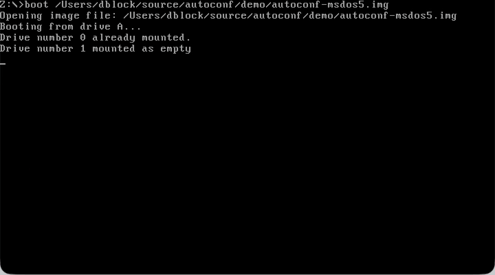

# Autoconf

Autoconf is a DOS device driver for selecting one of several configurations from a single `CONFIG.SYS`. Its defining feature is that a configuration key can be pressed before the driver loads: Autoconf later reads the key from the BIOS keyboard queue and continues booting with the selected configuration.

The original program was written by [Julien Pommier](http://gruntthepeon.free.fr) and published in *Science & Vie Micro* no. 88 in November 1991. I ([Daniel Doubrovkine](https://code.dblock.org/about/)) typed the printed listing by hand as my first x86 assembly program, then expanded it into the much larger bilingual Autoconf 3.00 beta 2 preserved here.

- Read the reconstructed [project history](HISTORY.md).
- Read my 2009 retrospective, [“Autoconf, World's Best Multiple Configurations Software”](https://code.dblock.org/2009/09/22/autoconf-worlds-best-multiple-configurations-software.html).
- Explore the [original article, recovered source, and boot demo](original/).
- Run the [MS-DOS 5 boot demonstration](demo/).
- Compare the [native MS-DOS 6.22 multiple-configuration demo](msdos6.2/).
- See [MegaBoot](https://github.com/dblock/megaboot), David Jilli's 1996 spiritual successor to Autoconf.

Autoconf is available under the [MIT License](LICENSE).
