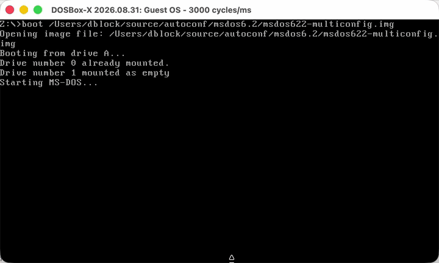

# MS-DOS 6.22 Multiple-Configuration Demo

MS-DOS 6.0 introduced built-in multiple configurations in March 1993. This demo uses the same three sample choices as the Autoconf demonstration, implemented with the native DOS 6 `[MENU]` and configuration-block syntax:

- `A` - Minimal DOS
- `B` - DOOM
- `C` - Windows 95

MS-DOS displays the choices as a numbered menu. Select `2` to boot the `B` - DOOM configuration. DOS exposes the selected block name to `AUTOEXEC.BAT` through the `%CONFIG%` environment variable.

Boot the private local image with DOSBox-X:

```sh
dosbox-x -fastlaunch -c "boot msdos6.2/msdos622-multiconfig.img"
```



## MS-DOS Image

The tested image is derived from the MS-DOS 6.22 ISO at <https://archive.org/details/ms-dos-6.22_20220302>, downloaded separately by the user. MS-DOS 6.22 remains proprietary Microsoft software.

Download the ISO as `MS-DOS 6.22.iso`. The ISO uses an El Torito 1.44 MB floppy-emulation boot image. From the repository root, install `mtools`, extract that embedded floppy, and replace its startup files:

```sh
brew install mtools

python3 - "MS-DOS 6.22.iso" msdos6.2/msdos622-multiconfig.img <<'PY'
from pathlib import Path
import struct
import sys

iso = Path(sys.argv[1]).read_bytes()
output = Path(sys.argv[2])

for lba in range(16, 32):
    descriptor = iso[lba * 2048:(lba + 1) * 2048]
    if descriptor[:7] != b"\x00CD001\x01":
        continue

    catalog_lba = struct.unpack_from("<I", descriptor, 71)[0]
    catalog = iso[catalog_lba * 2048:(catalog_lba + 1) * 2048]
    image_lba = struct.unpack_from("<I", catalog, 40)[0]
    output.write_bytes(iso[image_lba * 2048:image_lba * 2048 + 1_474_560])
    break
else:
    raise SystemExit("El Torito boot image not found")
PY

mcopy -o -i msdos6.2/msdos622-multiconfig.img \
  msdos6.2/CONFIG.SYS ::CONFIG.SYS
mcopy -o -i msdos6.2/msdos622-multiconfig.img \
  msdos6.2/AUTOEXEC.BAT ::AUTOEXEC.BAT
```

Keep `CONFIG.SYS` and `AUTOEXEC.BAT` in DOS CRLF format. Use `mcopy` rather than mounting the FAT image in macOS: the macOS FAT driver converts these files to LF while copying, and DOS `COMMAND.COM` does not reliably execute the resulting batch file.

`msdos622-multiconfig.img` is ignored by Git and must not be committed, published, or redistributed without permission from the applicable rights holder.
