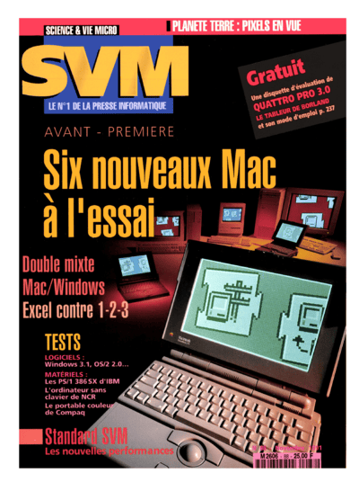

# Original Autoconf

This directory preserves the original Autoconf program by Julien Pommier, published in *Science & Vie Micro* no. 88 (November 1991), pages 227-233.

[](SVM-88-cover.png)

- `SVM-88-Autoconf-pages-227-233.pdf` is the canonical scanned article and complete printed listing.
- `SVM-88-cover.png` is the full-size cover extracted from page 1 of the complete issue scan.
- `SVM-88-cover-small.png` is the smaller copy displayed in the documentation.
- `AUTOCONF.ASM` is a transcription of the printed `AUTOCONF.ASM` listing.
- `READCONF.ASM` is a transcription of the printed `READCONF.ASM` listing.

The assembly files were recovered from the scan using OCR and manually corrected where the printed text was clear. They preserve the source for searching and comparison. Consult the PDF when exact punctuation or spacing matters.

The complete issue is available from the [Internet Archive](https://archive.org/details/science-et-vie-micro-088).

## Building under DOS

The transcriptions have been tested in DOSBox-X with the DOS real-mode build of [JWasm 2.20](https://github.com/Baron-von-Riedesel/JWasm/releases/tag/v2.20), a MASM-compatible assembler.

On macOS, install DOSBox-X:

```sh
brew install dosbox-x
```

Download and prepare the DOS toolchain in a temporary directory:

```sh
mkdir -p /tmp/autoconf-dos-build
cd /tmp/autoconf-dos-build
curl -fLO https://github.com/Baron-von-Riedesel/JWasm/releases/download/v2.20/JWasm_v220_dos.zip
unzip JWasm_v220_dos.zip
iconv -f UTF-8 -t CP437 ~/source/autoconf/original/AUTOCONF.ASM > AUTOCONF.ASM
iconv -f UTF-8 -t CP437 ~/source/autoconf/original/READCONF.ASM > READCONF.ASM
cp ~/source/autoconf/original/BUILD.BAT .
```

Run the build inside DOS:

```sh
SDL_VIDEODRIVER=dummy SDL_AUDIODRIVER=dummy \
  dosbox-x -silent -fastlaunch -time-limit 30 \
  -c "mount c /tmp/autoconf-dos-build" \
  -c "c:" \
  -c "BUILD.BAT" \
  -c "exit"
```

`-Zm` in `BUILD.BAT` enables MASM 5 compatibility, including the unscoped procedure labels used by the original source. A successful build creates `AUTOCONF.SYS` and `READCONF.COM`. The recovered listings currently assemble with JWasm 2.20 with zero warnings and zero errors.

The reproduced binaries are preserved in [`bin/`](bin/). See [`demo/`](demo/) for a bootable MS-DOS 5 demonstration of the original driver.
