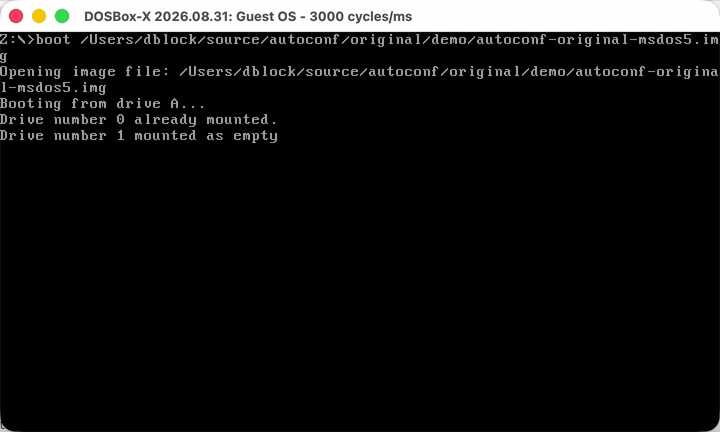

# Original 1991 Autoconf Boot Demo

This demo runs Julien Pommier's original Autoconf driver, published in *Science & Vie Micro* no. 88 in November 1991.

The menu contains:

- `A` - Minimal DOS
- `B` - DOOM
- `C` - Windows 95

Press `B` during the earlier stages of boot to select DOOM. The BIOS keeps the keystroke queued until the driver loads. The `/Q` option selects a QWERTY keyboard and `/T9` waits up to nine seconds before choosing the default configuration. `AUTOEXEC.BAT` runs the original 11-byte `READCONF.COM` to display the selected block.

Boot the private local image with DOSBox-X:

```sh
dosbox-x -fastlaunch -c "boot original/demo/autoconf-original-msdos5.img"
```



## Build the Original Driver

Build `AUTOCONF.SYS` and `READCONF.COM` as described in the [original source README](../README.md).

## Create the Boot Image

From the repository root on macOS, install `mtools`, download and extract the MS-DOS 5 boot disk, then create the private demo image:

```sh
brew install mtools
curl -fLO https://archive.org/download/dos-5.0-bootdisk/DOS5.0_bootdisk.zip
unzip DOS5.0_bootdisk.zip
cp DOS5.0_bootdisk/Dos5.0.img original/demo/autoconf-original-msdos5.img

mcopy -o -i original/demo/autoconf-original-msdos5.img \
  original/bin/AUTOCONF.SYS ::AUTOCONF.SYS
mcopy -o -i original/demo/autoconf-original-msdos5.img \
  original/bin/READCONF.COM ::READCONF.COM
mcopy -o -i original/demo/autoconf-original-msdos5.img \
  original/demo/CONFIG.SYS ::CONFIG.SYS
mcopy -o -i original/demo/autoconf-original-msdos5.img \
  original/demo/AUTOEXEC.BAT ::AUTOEXEC.BAT
```

The directory created by `unzip` may differ between archive versions. Locate `Dos5.0.img` and adjust the `cp` source path if necessary.

The image is ignored by Git and must not be committed, published, or redistributed. MS-DOS 5 remains proprietary Microsoft software.
